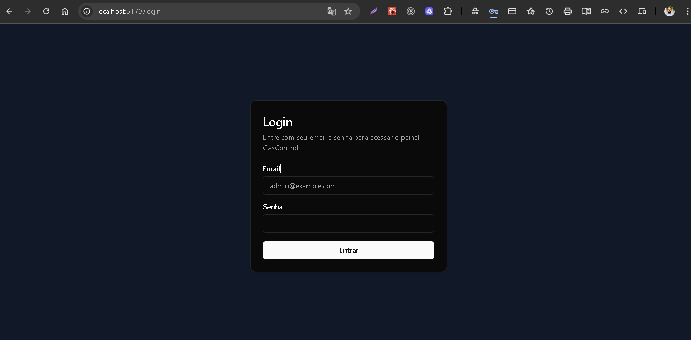
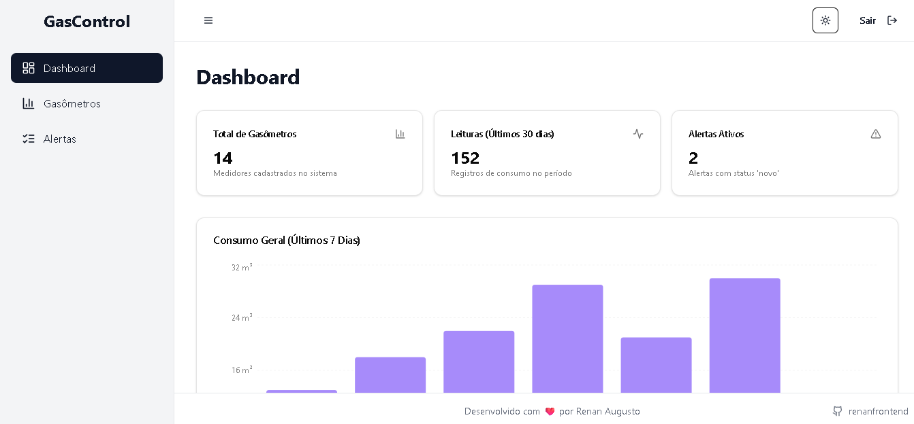
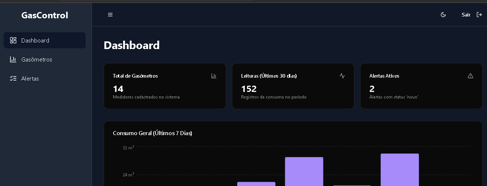
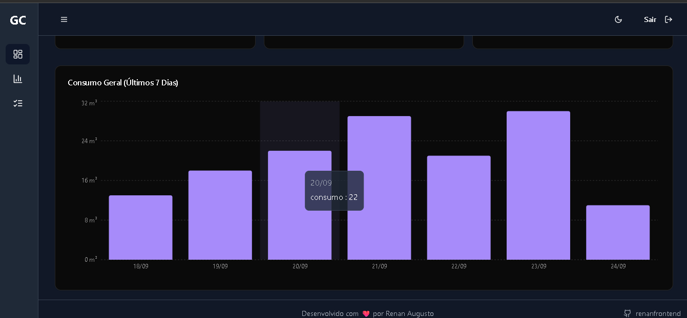
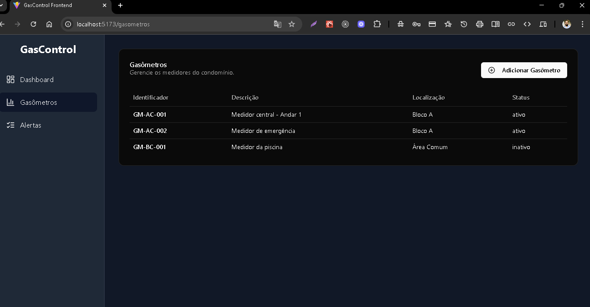

# GasControl - Frontend


> **Nota:** Esta aplicação é uma interface de usuário completa e funcional. Atualmente, ela opera com uma API mockada (simulada) para permitir a demonstração de todos os recursos visuais e de interação. A integração com o backend e a implementação de testes E2E são os próximos passos planejados.

Este projeto é a interface web (frontend) do **GasControl**, um sistema para gestão de consumo de gás em condomínios, permitindo o cadastro de medidores, registro de leituras e visualização de relatórios.












---

## ✨ Funcionalidades Principais
A interface para os seguintes recursos está completamente implementada:

-   **Dashboard Analítico:** Exibe KPIs (Key Performance Indicators) como total de medidores e alertas ativos, além de um gráfico de consumo diário para análise de dados.
-   **Gerenciamento de Gasômetros:** Tela para listagem e visualização de todos os medidores cadastrados.
-   **Monitoramento de Alertas:** Página dedicada à visualização de alertas gerados pelo sistema.
-   **Fluxo de Autenticação Seguro:** Interface de login e sistema de rotas protegidas que garantem o acesso apenas a usuários autenticados.

## 💎 Diferenciais e Melhorias de UI/UX
Além dos requisitos básicos, foram implementadas diversas funcionalidades para aprimorar a experiência do usuário:

-   **Sidebar Inteligente:** Um menu lateral retrátil que se expande ao passar o mouse (hover) e pode ser fixado com um clique, otimizando o espaço de tela.
-   **Tema Claro e Escuro (Light/Dark Mode):** Um seletor de tema completo que permite ao usuário escolher entre os modos claro, escuro ou sincronizar com a preferência do seu sistema operacional.
-   **Layout Completo e Profissional:** A aplicação conta com Header e Footer, criando uma experiência de navegação coesa e profissional.
-   **Componente de Logout:** Um botão de "Sair" funcional no header que encerra a sessão do usuário e o redireciona para a tela de login.
-   **Totalmente Responsivo:** A interface foi construída para se adaptar a diferentes tamanhos de tela, de desktops a dispositivos móveis.

## 🛠️ Tecnologias Utilizadas
Este projeto foi construído com um conjunto de tecnologias modernas para garantir performance e manutenibilidade.

-   **Base e Estrutura:**
    -   **React:** Biblioteca principal para a construção da interface.
    -   **Vite:** Ferramenta de build extremamente rápida para desenvolvimento.
    -   **TypeScript:** Superset do JavaScript que adiciona tipagem estática.

-   **Estilização e Componentes:**
    -   **Tailwind CSS:** Framework CSS utility-first para estilização rápida e customizável.
    -   **shadcn/ui:** Coleção de componentes reutilizáveis, acessíveis e customizáveis.

-   **Navegação e Estado:**
    -   **React Router DOM:** Para gerenciamento de rotas e navegação na SPA.
    -   **React Context API:** Utilizada para o gerenciamento do estado de autenticação.
    -   **Zustand:** Gerenciador de estado minimalista para o controle de estados da UI (ex: sidebar).

-   **Autenticação e Formulários:**
    -   **Gerenciamento de Token:** Simulação de persistência de sessão via `localStorage`.
    -   **React Hook Form & Yup:** Para construção e validação de formulários de forma performática e declarativa.

-   **Visualização de Dados:**
    -   **Recharts:** Biblioteca para a criação de gráficos interativos e componentizados.

-   **Temas (Light/Dark Mode):**
    -   **next-themes:** Gerencia a troca de temas e a persistência da escolha do usuário.

## 🚀 Como Executar o Projeto

Siga os passos abaixo para rodar a aplicação frontend em modo de desenvolvimento.

### Pré-requisitos
-   Node.js (v18 ou superior)
-   Git

### Passos de Execução

1.  **Clone o repositório:**
    ```bash
    git clone [https://github.com/renanfrontend/gascontrol-frontend.git](https://github.com/renanfrontend/gascontrol-frontend.git)
    cd gascontrol-frontend
    ```

2.  **Crie o arquivo de ambiente:**
    ```bash
    cp .env.example .env
    ```

3.  **Instale as dependências:**
    ```bash
    npm install
    ```

4.  **Execute a aplicação:**
    ```bash
    npm run dev
    ```
    A aplicação estará disponível em `http://localhost:5173`.

## 📝 Licença
Este projeto é licenciado sob a Licença MIT.

Copyright (c) 2025 Renan Augusto dos Santos.